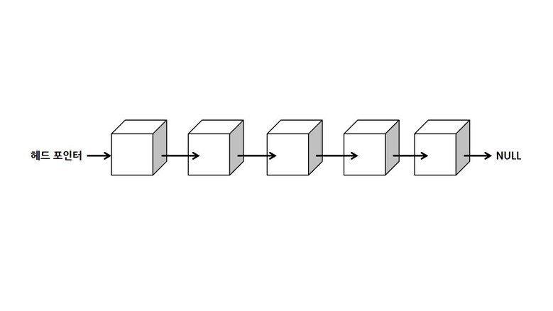
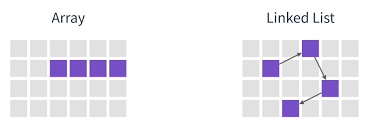

# LinkedList
### 1. 연결 리스트란 무엇인가 ?
* 연결 리스트(Linked List)는 각 노드가 데이터와 다음 노드를 가리키는 링크로 구성되어있다.
* 배열과 달리, 연속된 메모리 공간에 저장되지 않는다.



##### 배열 vs 연결 리스트 



| 항목 | 배열 (Array) | 연결 리스트 (Linked List) |
|------|---------------|-----------------------------|
| 메모리 구조 | 연속된 공간 | 비연속 (동적 연결) |
| 삽입/삭제 성능 | 느림 (O(n)) | 빠름 (O(1), 단 노드 참조 시) |
| 접근 속도 | 빠름 (O(1)) | 느림 (O(n)) |
| 크기 조절 | 고정 | 동적 |

### 2. 연결 리스트의 ADT
- `insert(pos, item)` : `pos` 위치에 `item` 삽입
- `delete(pos)` : `pos` 위치 노드 삭제
- `getEntry(pos)` : `pos` 위치 노드의 값 반환
- `isEmpty()` : 리스트가 비었는지 확인
- `size()` : 리스트의 길이 반환
- `clear()` : 전체 노드 제거
- `print_list()` : 모든 노드 출력


### 3. Python : 연결 리스트 구현
``` python
class Node:
    def __init__(self, data, link=None):
        self.data = data
        self.link = link

class LinkedList:
    def __init__(self):
        self.head = None

    def isEmpty(self):
        return self.head is None

    def insert(self, pos, data):
        new_node = Node(data)
        if pos == 0:
            new_node.link = self.head
            self.head = new_node
        else:
            prev = self.getNode(pos - 1)
            new_node.link = prev.link
            prev.link = new_node

    def delete(self, pos):
        if pos == 0:
            self.head = self.head.link
        else:
            prev = self.getNode(pos - 1)
            prev.link = prev.link.link

    def getNode(self, pos):
        node = self.head
        for _ in range(pos):
            node = node.link
        return node

    def print_list(self):
        node = self.head
        while node:
            print(node.data, end=" -> ")
            node = node.link
        print("None")
```
### 4. C : 연결 리스트 구현
``` c
#include <stdio.h>
#include <stdlib.h>

typedef struct Node {
    int data;
    struct Node* link;
} Node;

Node* create_node(int data, Node* link) {
    Node* newnode = (Node*)malloc(sizeof(Node));
    newnode->data = data;
    newnode->link = link;
    return newnode;
}

void insert(Node** head, int data) {
    Node* newnode = create_node(data, *head);
    *head = newnode;
}

void print_list(Node* head) {
    Node* cur = head;
    while (cur != NULL) {
        printf("%d -> ", cur->data);
        cur = cur->link;
    }
    printf("NULL\n");
}

```
### 5. Java : 연결 리스트 구현
``` java
class Node {
    int data;
    Node link;

    Node(int data) {
        this.data = data;
        this.link = null;
    }
}

class LinkedList {
    private Node head;

    public LinkedList() {
        head = null;
    }

    public void insert(int data) {
        Node newNode = new Node(data);
        newNode.link = head;
        head = newNode;
    }

    public void printList() {
        Node current = head;
        while (current != null) {
            System.out.print(current.data + " -> ");
            current = current.link;
        }
        System.out.println("null");
    }
}

```
### 6. 연결 리스트의 종류


* 단일 연결 리스트 : 가장 기본적인 형태. 한 방향으로 연결
* 이중 연결 리스트 : 앞, 뒤를 모두 참조할 수 있어 양방향 이동 가능
* 원형 연결 리스트 : 마지막 노드가 첫 노드를 가리킴. 순환구조
``` python
# 단일 연결 리스트의 노드
class Single_node :
    def __init__(self,data):
        self.data = data
        self.next = None

# 이중 연결 리스트의 노드
class Double_node :
    def __init__(self,data):
        self.data = data
        self.prev = None
        self.next = None
```
| 리스트 종류             | 구조                                  | 방향성   | 특징                    |
|------------------------|---------------------------------------|----------|-------------------------|
| 단일 연결 리스트(Singly) | `head → node1 → node2 → ... → None`   | 한 방향  | 가장 기본적인 형태       |
| 이중 연결 리스트(Doubly) | `prev ←→ node ←→ next`                | 양방향   | 앞/뒤로 모두 이동 가능  |
| 원형 연결 리스트(Circular) | `tail → ... → head → tail (순환)` 

### 7. 마무리하며
연결 리스트는 배열보다 메모리 활용이 유연하고 , 삽입/삭제 연산이 빠르다는 장점이 있다.
노드사이의 연결 구조에 따라 많은 자료구조들이 파생될 수 있으므로 link를 다루는 아이디어에 집중하자 !