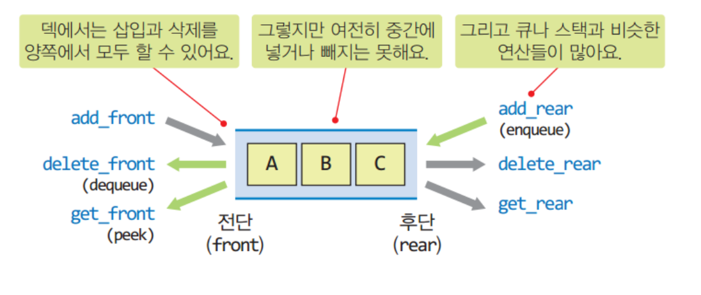

# Deque
### 1. Deque 란 ?



스택이나 큐보다 입출력이 자유로운 자료구조로  **Double-ended queue**의 줄임말이다.
양쪽 끝에서 삽입과 삭제가 모두 가능한 자료구조 이므로 **Stack**과 **Queue**의 기능을 모두 포함하고 있어 유연한 자료 처리에 적합하다.

### 2. Deque ADT

| 연산 | 설명 |
|------|------|
| `add_front(item)` | 앞쪽(왼쪽)으로 삽입 |
| `add_rear(item)`  | 뒤쪽(오른쪽)으로 삽입 |
| `remove_front()`  | 앞쪽 요소 제거 |
| `remove_rear()`   | 뒤쪽 요소 제거 |
| `peek_front()`    | 앞쪽 요소 확인 (삭제 X) |
| `peek_rear()`     | 뒤쪽 요소 확인 (삭제 X) |
| `is_empty()`      | 덱이 비었는지 확인 |
| `is_full()`       | (배열 기반일 경우) 가득 찼는지 확인 |
> 덱은 구조상 큐와 더 비슷하다 !
> 앞서 만든 CircularQueue를 상속하여 만들어보자.

### 3. Python : Circular Deque
``` python
# CircularQueue
class CircularQueue :
    def __init__(self, capacity = 8):
        self.capacity = capacity
        self.array = [None] * capacity
        self.front = 0
        self.rear = 0

    def isEmpty(self):
        return self.front == self.rear
    
    def isFull(self):
        return self.front == (self.rear +1) % self.capacity
    
    def enqueue(self, e):
        if not self.isFull():
            self.rear = (self.rear +1) % self.capacity
            self.array[self.rear] = e
        else : pass

    def dequeue(self):
        if not self.isEmpty() :
            self.front = (self.front + 1) % self.capacity
            return self.array[self.front]
        else : pass
    
    def peek(self):
        if not self.isEmpty():
            return self.array[(self.front+1) % self.capacity]
        
    def size(self):
        return (self.rear - self.front + self.capacity) % self.capacity
    
    def __str__(self) :
        if self.front < self.rear :
            return str(self.array[self.front+1:self.rear+1])
        else :
            return str(self.array[self.front+1:self.capacity] + self.array[0:self.rear+1])
        

# CircularDeque
# CircularQueue 상속
class CircularDeque(CircularQueue) :
    def __init__(self, capacity=10):
        # 생성자 호출
        super().__init__(capacity)
    # isEmpty, isFull, size, __str__ 은 상속

    # 이름이 바뀌는 연산들
    def addRear(self, e) : self.enqueue(e) 
    def deleteFront(self) : return self.dequeue()
    def getFront(self) : return self.peek()

    # 새로 구현되는 연산들
    def addFront(self, e) :
        if not self.isFull() :
            self.array[self.front] = e
            self.front = (self.front -1 + self.capacity) % self.capacity
        else : pass

    def deleteRear(self) :
        if not self.isEmpty() :
            e = self.array[self.rear]
            self.rear = (self.rear -1 + self.capacity) % self.capacity
            return e
        else : pass

    def getRear(self):
        if not self.isEmpty() :
            return self.array[self.rear]
        else : pass
```

### 4. 마무리하며
| 자료구조 | 특징                              |
|----------|-----------------------------------|
| Stack    | 한쪽 삽입/삭제 (LIFO)             |
| Queue    | 한쪽 삽입, 반대쪽 삭제 (FIFO)     |
| Deque    | 양쪽 모두 삽입/삭제 가능 (유연함) |

> `Deque`는 다양한 알고리즘에서 매우 유용하게 사용되며,  
> 내장 모듈 `collections.deque`를 통해 쉽게 활용할 수 있다.