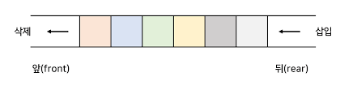

# Queue

### 1. 큐란 무엇인가?

큐(Queue)는 **선입선출(FIFO, First In First Out)** 방식으로 동작하는 선형 자료구조이다.  
먼저 들어간 데이터가 먼저 나오는 구조로, 현실의 줄 서기(버스 탑승, 티켓 구매 등)와 유사하다.



---

### 2. 큐의 ADT

- `enqueue(item)` : 큐의 뒤에 항목 추가
- `dequeue()` : 큐의 앞에서 항목 제거
- `peek()` : 큐의 앞 항목 조회
- `isEmpty()` : 큐가 비었는지 확인
- `size()` : 큐에 들어있는 항목 수 반환

---

### 3. Python : 리스트 기반 큐 구현

```python
class Queue:
    def __init__(self):
        self.items = []

    def isEmpty(self):
        return len(self.items) == 0

    def enqueue(self, item):
        self.items.append(item)

    def dequeue(self):
        if not self.isEmpty():
            return self.items.pop(0)

    def peek(self):
        if not self.isEmpty():
            return self.items[0]

    def size(self):
        return len(self.items)
```

### 4. C : 연결 리스트 기반 큐 구현
``` c
#include <stdio.h>
#include <stdlib.h>

typedef struct Node {
    int data;
    struct Node* link;
} Node;

typedef struct {
    Node* front;
    Node* rear;
} Queue;

void init(Queue* q) {
    q->front = q->rear = NULL;
}

void enqueue(Queue* q, int data) {
    Node* node = (Node*)malloc(sizeof(Node));
    node->data = data;
    node->link = NULL;
    if (q->rear) q->rear->link = node;
    else q->front = node;
    q->rear = node;
}

int dequeue(Queue* q) {
    if (!q->front) return -1;
    Node* tmp = q->front;
    int data = tmp->data;
    q->front = q->front->link;
    if (!q->front) q->rear = NULL;
    free(tmp);
    return data;
}
```

### 5. Java : 연결 리스트 기반 큐 구현
``` java
class Node {
    int data;
    Node link;

    Node(int data) {
        this.data = data;
        this.link = null;
    }
}

class Queue {
    private Node front, rear;

    public Queue() {
        front = rear = null;
    }

    public void enqueue(int item) {
        Node node = new Node(item);
        if (rear != null) rear.link = node;
        else front = node;
        rear = node;
    }

    public int dequeue() {
        if (front == null) throw new RuntimeException("Empty Queue");
        int data = front.data;
        front = front.link;
        if (front == null) rear = null;
        return data;
    }
}
```
### 6. 큐의 종류
| 큐 종류           | 설명                                         |
|------------------|----------------------------------------------|
| 일반 큐          | 기본적인 선입선출 구조                       |
| 원형 큐          | 배열의 공간 낭비를 줄이기 위해 인덱스를 순환 |
| 덱 (Deque)        | 양쪽에서 삽입/삭제 가능                     |
| 우선순위 큐       | 값의 우선순위에 따라 처리 순서가 결정됨      |


### 7. 큐 vs 스택
| 항목       | 큐 (Queue)              | 스택 (Stack)            |
|------------|-------------------------|--------------------------|
| 구조       | 선입선출 (FIFO)         | 후입선출 (LIFO)          |
| 삽입 위치  | 뒤쪽 (rear)             | 위쪽 (top)              |
| 삭제 위치  | 앞쪽 (front)            | 위쪽 (top)              |
| 예시       | 줄 서기, 인쇄 대기열    | 되돌리기, 재귀 호출      |

### 8. 마무리하며
큐는 자료가 **입력된 순서를 유지하면서 처리할 필요가 있는 상황**에서 가장 적합한 자료구조이다.  
운영체제의 작업 스케줄링, 네트워크 버퍼, 실시간 처리 시스템 등 실무에서도 매우 널리 쓰인다.

