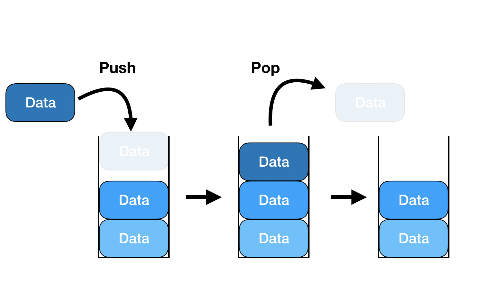

# Stack 
* 스택이란 , 한 쪽 끝에서만 삽입과 삭제가 가능한 선형 자료구조이다.
* **Last In, First Out (LIFO)**


* 스택은 기본적으로 **후입선출**구조로 구성되어있다.

### Stack의 ADT
* `pop()` : 스택에서 가장 위에 있는 항목을 제거한다.
* `push(item)`: `item`을 스택의 가장 윗 부분에 추가한다.
* `peek()`: 스택의 가장 위에 있는 항목을 반환한다.
* `isEmpty()` : 스택이 비어있는지 확인한다.
* `size()` : 현재 스택에 들어있는 항목의 수를 센다.

### Stack이 사용되는 사례
* 함수 호출 관리 (Call Stack)
* 괄호 검사, 문법 검사 
* Undo / Redo 기능
* 수식 계산 (후위 표기법 / 전위 표기법)
* DFS
* 백트래킹 등

### Python : Stack 구현
``` py
class Stack:
    def __init__(self):
        self.items = []

    def push(self, item):
        self.items.append(item)

    def pop(self):
        if not self.is_empty():
            return self.items.pop()
        raise IndexError("pop from empty stack")

    def peek(self):
        if not self.is_empty():
            return self.items[-1]
        raise IndexError("peek from empty stack")

    def is_empty(self):
        return len(self.items) == 0

    def size(self):
        return len(self.items)
```

### C : Stack 구현
``` c
#include <stdio.h>
#include <stdlib.h>

typedef struct Node {
    int data ;
    struct Node* next ;
} Node;

typedef struct {
    Node* top;
} Stack;

void init(Stack* s){
    s->top = NULL ;
}

int is_empty(Stack* s){
    return s->top == NULL;
}

// 가장 최근에 push된 node가 top
void push(Stack* s , int item){
    Node* new_node = (Node*)malloc(sizeof(Node));
    new_node->data = item;
    new_node->next = s->top;
    s->top = new_node;
}

int pop(Stack* s){
    if(is_empty(s)){
        printf("Stack is empty\n");
        exit(1);
    }

    Node* temp = s->top;
    int value = temp->data;
    s->top = temp->next;
    free(temp);
    return value;
}

int peek(Stack* s){
    if(is_empty(s)){
        printf("Stack is empty\n");
        exit(1);
    }
    return s->top->data;
}

int size(Stack* s){
    int count = 0 ;
    Node* current = s->top;
    // 모든 노드 순회
    while(current != NULL){
        count++;
        current = current->next;
    }
    return count;
}
```

### Java : Stack 구현
``` java

public class LinkedStack{
    private static class Node {
        int data;
        Node next;

        Node(int data){
            this.data = data;
        }
    }

    private Node top ;

    public LinkedStack(){
        top = null;
    }

    public void push(int item){
        Node newNode = new Node(item);
        newNode.next = top;
        top = newNode;
    }
    public int pop(){
        if(isEmpty()){
            throw new RuntimeException("Stack is empty");
        }
        int item = top.data;
        top = top.next;
        return item;
    }

    public int peek(){
        if(isEmpty()){
            throw new RuntimeException("Stack is empty");
        }
        return top.data;
    }

    public boolean isEmpty(){
        return top == null ;
    }

    public int size() {
        int count = 0;
        Node current = top;
        while (current != null){
            count ++;
            current = current.next;
        }
        return count ;
    }
}
```