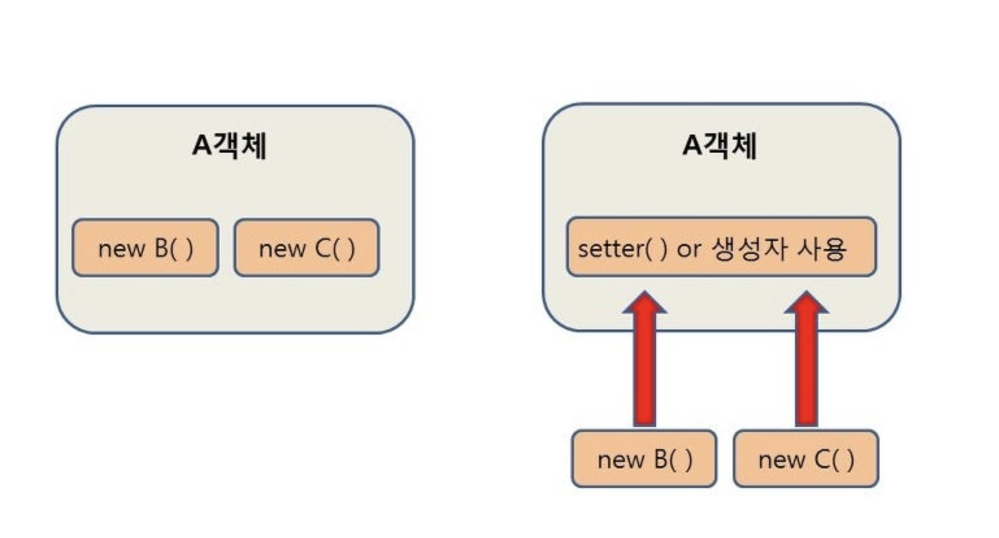

# DI , IoC에 대하여
Spring의 핵심 개념이자 강력한 무기인 DI, IoC에 대해서 알아보자.

### 1. 제어의 역전 (IoC, Inversion of Control)
`IoC`란 객체의 생성과 의존성 관리의 제어권을 프레임워크가 가지는 개념이다.
개발자는 객체의 생명주기 (객체의 생성, 초기화, 소멸, 메서드 호출 등)을 직접 관리하였다.
그러나 Spring에서는 프레임워크가 객체의 생명주기를 직접 제어한다.
즉, 개발자는 객체의 정의와 메서드들을 직접 구현하기는 하지만 객체들이 언제 호출되고 언제 소멸하는지 신경쓰지 않아도 된다는 개념이다.

**프로그램의 제어권이 프레임워크에게 넘어간다는 뜻이다.**

* **제어권이 개발자에게 있음**
``` java
// 개발자가 직접 호출 및 사용
class Service {
    public void serve() {
        System.out.println("Service 호출되었음.");
    }
}

class Controller {
    private Service service;

    public Controller() {
        this.service = new Service();  //의존 객체를 직접 생성
    }

    public void doSomething() {
        service.serve();
    }
}
```
-> 객체 생성의 책임과 제어 흐름이 전부 개발자에게 있다.

* **IoC 적용 방식**
``` java
@Service
class MyService {
    public void serve() {
        System.out.println("Service 호출됨");
    }
}

@RestController
class MyController {

    // MyService 객체가 필요하네 ?
    private final MyService service;

    // 객체 주입은 스프링이 함
    public MyController(MyService service) {
        this.service = service;
    }

    @GetMapping("/hello")
    public void hello() {
        service.serve();
    }
}
```
-> 컨트롤러는 단지 필요한 객체가 있다고 선언만 한다. -> Spring이 자동으로 주입해준다.
* `MyService`라는 객체가 필요하다는 **의존성 선언**을 하였다.
* `new MyService()`라고 개발자가 직접 생성하지 않았으나, Spring이 알아서 객체를 생성하고 주입해준다.
* 즉, IoC가 적용되면, 생성자에 의존 객체를 인자로만 넣어두면 `new`를 안해도 된다.
    1. `MyService`를 `@Service`로 인식해 `Bean`으로 등록한다.
    2. `MyController`를 생성할 때 `MyService` 인스턴스를 주입한다.

### 2. IoC 동작 원리
1. Spring이 애플리케이션 실행시 컴포넌트 스캔으로 `@Service`, `@RestController`등을 탐색한다.
2. `MyService`객체를 먼저 Bean으로 등록하고 관리한다.
3. `MyController`를 생성할 때, 생성자에 `MyService`가 필요하다는 걸 인식한다.
4. `IoC 컨테이너`가 `MyService` 인스턴스를 찾아서 자동으로 생성자에 주입해준다.

### 3. 의존성 주입 (DI, Dependency Injection)
DI는 객체가 의존하는 다른 객체를 직접 생성하지 않고, 외부에서 주입(Injection)하는 방식이다.
다만 DI는 IoC의 개념을 구현하기 위해 사용중인 디자인 패턴 중 하나다.



**의존관계란?**
* 어떤 클래스가 다른 클래스를 참조하는 것을 의미한다.
* 왼쪽 그림에서, `A객체`가 `B객체`와 `C객체`를 참조하는 형태이다.
* 오른쪽 그림은 외부에서 의존관계에 있는 `B,C`객체를 생성한 후 `setter`또는 생성자를 사용하여 의존 객체를 주입 하고 있는 형태이다.

* DI가 적용되지 않은 방식
``` java
// 서비스 클래스
public class MyService {
    public String serve() {
        return "서비스 동작 중...";
    }
}

// 컨트롤러 클래스
public class MyController {
    private MyService service;

    public MyController() {
        // 직접 객체 생성 → 강한 결합 (tight coupling)
        this.service = new MyService();
    }

    public void handleRequest() {
        System.out.println(service.serve());
    }
}

// 실행 클래스
public class Main {
    public static void main(String[] args) {
        MyController controller = new MyController();
        controller.handleRequest();
    }
}
```
  * `MyController`가 `MyService`를 직접 생성하고 있다. (`new MyService()`)
  * 객체 간 강한 결합도 -> `MyService`가 바뀌면 `MyController`도 수정하여야한다.
  * 재사용성, 확장성, 유지보수성이 떨어진다.

* DI가 적용된 방식
``` java
// MyService.java
@Service
public class MyService {
    public String serve() {
        return "서비스 동작 중...";
    }
}

// MyController.java
@RestController
public class MyController {

    private final MyService service;

    // 스프링이 이 생성자에 MyService를 주입해줌 (DI)
    public MyController(MyService service) {
        this.service = service;
    }

    @GetMapping("/hello")
    public String hello() {
        return service.serve();
    }
}
```
  * DI가 적용되며 객체 생성의 대한 책임을 `MyController`가 가지고 있지 않는다.
  * 개발자는 `MyService`객체 말고 다른 객체를 사용하고싶을때, 의존성 주입 부분인 `MyController(MyServie service)` 부분만 다른 객체로 넘겨주면 코드를 재사용할 수 있게된다.

### 4. IoC와 DI를 사용하여 얻는 장점은 무엇인가 ?
1. 객체 간 결합도 감소 (Low Coupling)
    * 전통 방식에서는 객체가 직접 다른 객체를 생성한다. -> **강한 결합**
    * DI를 사용하면 객체 간 관계를 컨테이너가 관리한다. -> **느슨한 결합**
    -> 변경에 유연하며, 하나의 구현체만 바꿔도 전체 시스템에 영향을 주지 않는다.
2. 유지보수화 확장성 향상
    * 새로운 기능을 추가하거나 기존 구현체를 바꾸더라도 의존성 주입 부분만 수정하면 되므로 코드 수정이 최소화 된다.
    -> OCP(개방/폐쇄 원칙) 실현 가능
    -> 기능 확장이 쉬움
3. 테스트 용이성
    * 직접 `new`를 하지 않기 때문에 테스트시 `mock`객체나 `fake`객체를 주입할 수 있다.
    -> 단위 테스트, 통합 테스트 작성이 쉬워진다.
4. 재사용성 증가
    * 의존성 주입을 통해 여러 클래스에서 같은 `Bean`사용 가능
    * 하나의 객체를 여러 곳에서 공유함으로써 코드 중복을 줄인다.
    -> 코드 중복도가 감소하고, 공통 로직 분리가 용이해 진다.
5. 객체 생명주기 관리
    * Spring `IoC 컨테이너`는 Bean의 생성, 초기화, 소멸까지 자동 관리한다.
    -> 개발자는 객체 관리를 신경 쓰지 않아도 되며 메모리를 효율적으로 사용할 수 있게된다.
6. 유연한 구조
    * 어떤 구현체를 사용할지, 어떤 Bean을 주입할지는 의존성 주입이나 어노테이션을 활용하여 결정할 수 있다.
    * 코드 수정 없이 새로운 기능을 도입할 수 있다.
    -> 배포 없이 운영 환경 설정만 바꿔도 동작 변경 가능해진다.
    -> 모듈화에 용이해진다.