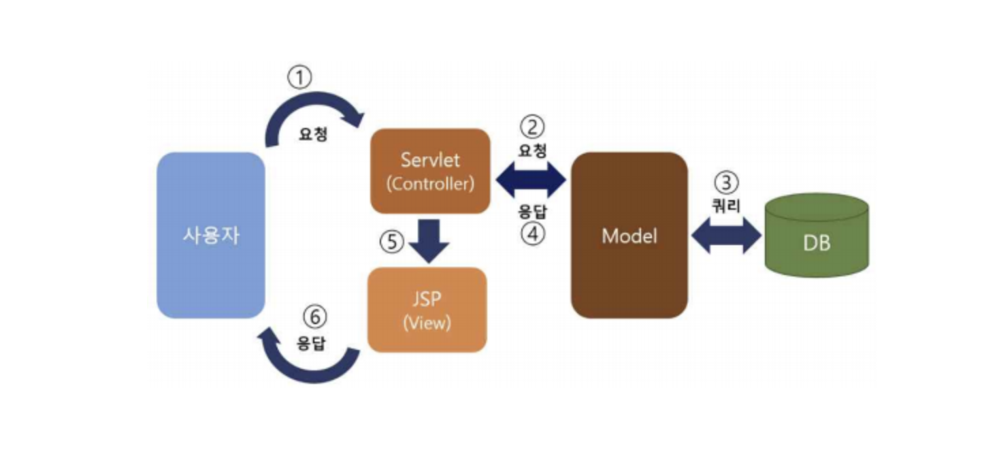
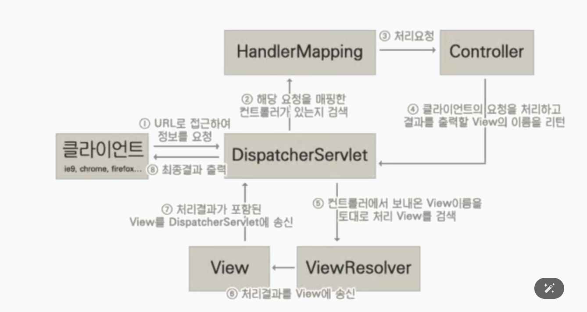

# Spring FrameWork 란?

### 1.Framework
* **프레임워크란** , 개발할 때 필요한 기본 뼈대나 구조를 미리 제공해주는 도구이자 약속이다.
* 프레임 워크를 사용하면 **생산성 증가, 코드의 일관성, 보안, 유지보수**의 측면에서 장점이 있다.
* 자주 쓰이는 기능을 모아둔 클래스들의 모음이라고 생각하면 편하다.

***

### 2.Framework vs Library
* 라이브러리
    * 개발자가 필요한 기능을 직접 호출하여 사용한다. 
    * 개발자가 중심이고, 라이브러리는 개발자를 도와주는 **도구** 일뿐이다.
* 프레임워크
    * 프레임워크가 개발자의 코드를 불러서 실행한다. (**제어의 역전, IOC**)
    * 전체 구조를 프레임워크가 주도하고, 개발자는 그 안에 필요한 코드만 만들어낸다.
  
***

### 3.Spring 이란?
* Python에서의 `Django`와 같이, Java기반의 애플리케이션을 쉽게 만들어주는 프레임워크를 **Spring Framework** 라고 한다.
* Spring의 장점
    1. **생산성** : 복잡한 설정 없이 빠르게 개발 가능
    2. **확장성** : 다양한 모듈 제공 (Spring MVC, Spring Security, Spring Data 등)
    3. **OOP** : 객체지향 설계에 최적화 된 구조이다.
    4. **DI(의존성 주입)** : 객체 생성과 연결을 자동으로 관리해준다.
    5. **IOC(제어의 역전)** : 프레임워크가 개발자의 코드를 실행한다.
    * DI, IOC는 다른 글에서 따로 다루겠다. 매우 중요한 개념 !

***

### 4.Spring의 구성


* **1. Core Container**
  * Spring의 가장 기본 뼈대이다.
  * 객체 생성 및 의존성 주입(DI), 설정 등을 담당한다.
    * `Beans` : 객체 등록 및 관리를 하고, 생명 주기를 관리한다.
    * `Core` : DI, IoC 컨테이너 기능 , 항상 직간접적으로 이 Spring Core에 대한 종속성을 가진다.
    * `Context` : `ApplicationContext`로 전체 앱 설정 관리
    * `SpEL` : 객체를 동적으로 표현 / 조작하는 표현 언어 (Spring EL)
* **2. Data Access / Integration**
  * 데이터베이스 연동 관련 모듈들이 있다.
    * `JDBC` : 순수 자바 방식의 DB연동법이다. JDBC 템플릿을 제공한다.
    * `ORM` : JPA, Hibernate 등 ORM Framework를 제공한다.
    * `Transaction` : Transactions Management API는 데이터베이스 뿐만 아니라 객체의 Transaction을 관리해준다.
* **3. Web (Spring MVC)**
  * `Web` : 웹에대한 기초적인 부분들을 관리한다.
  * `Web Servlet` : 웹 애플리케이션 실행을 위한 MVC 구현이 되어있다.
  * `Web Socket` : 클라이언트와 서버를 잇는 시스템을 구축하는데 도움을 준다.

***

### 5.MVC 디자인 패턴
* MVC는 **Model, View, Controller**의 약자로 , 클라이언트와 상호작용하는 소프트웨어를 세가지로 나누어 설계한다.
* 역할을 분리하여 **코드의 유지보수, 확장성, 협업**을 쉽게하기 위한 디자인 패턴이다.
* 예를 들어, 웹에서 사용자가 버튼을 클릭하면 ...
``` css
[View] 사용자 입력 -> [Controller] 요청 처리 -> [Model] 데이터 처리 -> [View] 결과 출력
```

* **1. Model**
  * 비즈니스 로직, 데이터 처리 담당
  * DB와 연동, 계산, 처리등 핵심 기능 수행
  * `@Entity`, `Service`, `Repository`
    ``` java
    @Entity
    public class Post {
        private Long id ;
        private String title ;
        private String content ;
    }
    ```

* **2. Controller**
  * 사용자의 **Request**를 받아서 처리하고, View나 Model로 연결한다.
  * 로직의 흐름을 제어한다.
  * `@Controller`, `RestController`
    ``` java
    /*
    예 : "/posts/1" 요청이 들어오면 postService 로 전달한다.
    */
    @RestController
    @RequestMapping("/posts")
    public class PostController {
        @GetMapping("/{id}")
        public Post getPost(@PathVariable Long id) {
            return postService.findById(id);
        }
    }
    ```

* **3. View**
  * 사용자에게 보여지는 화면
  * HTML, Thymeleaf, JSP, React 등으로 표현 가능하다.



***

### 6.Spring 동작 과정



``` css
Client -> DispatcherServlet -> HandlerMapping -> Controller -> Model -> ViewResolver -> View -> Client
```

* **1. DispatcherServlet**
  * 애플리케이션으로 들어오는 모든 Request를 받는다. 값들을 `Controller`에게 전달하고, 그 결과값들을 `View`에 전달하는 흐름을 제어한다.
  
* **2. HandelrMapping**
  * Request URL에 따라 `Controller`를 매칭시켜준다.
  
* **3. Controller**
  * Request를 처리한후 결과 값들을 `DispatcherServlet`에게 return해준다.
  
* **4. ModelAndView**
  * `Controller`가 처리한 결과와 그 결과를 보여줄 `View`에 대한 정보를 담고 있는 객체이다.
  
* **5. ViewResolver**
  * `View` 관련 정보를 가지고 클라이언트에게 포워딩할 실제 `View`파일을 찾아주는 역할이다.

* **6. View**
  * `Controller`가 처리한 결과값을 보여줄 `View`를 생성한다.
