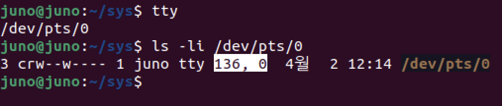
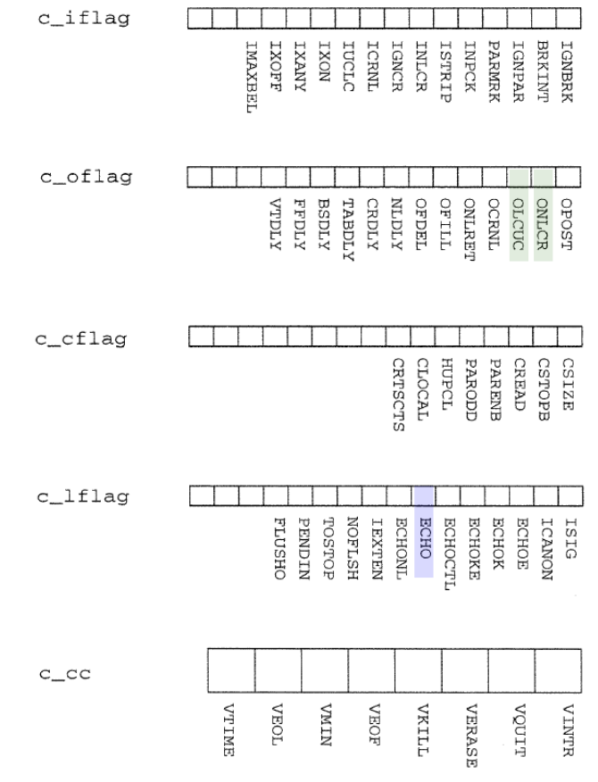
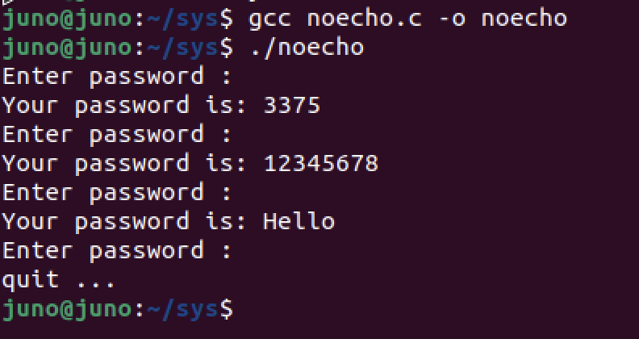
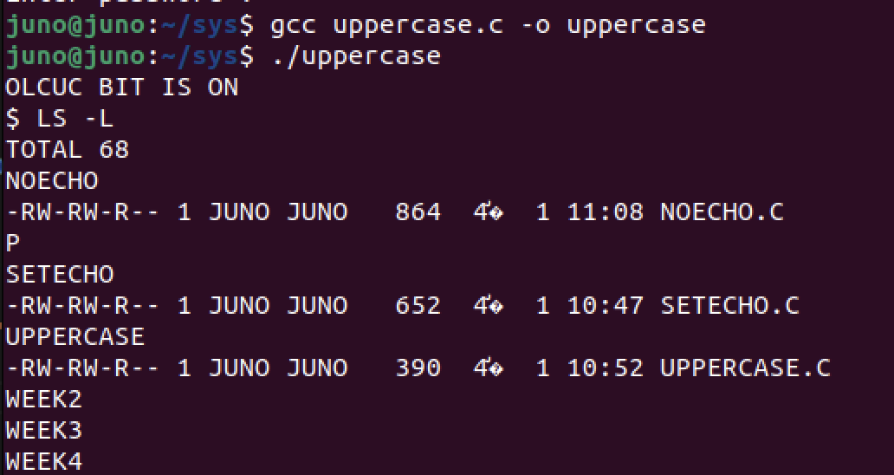

# Unix Device Control : stty, ioctl, termios
### 1.디바이스와 파일의 공통점
* Unix에서, 모든 디바이스는 파일처럼 여겨진다.
  * 각각의 디바이스들은 다음을 가진다:
    * a filename
    * an inode number
    * an owner
    * permission bits
    * a last-modified time

* 모든 디바이스(터미널, 프린터 등)는 `/dev/tty0` 같은 경로를 갖고, 일반 파일처럼 `open`, `read`, `write` 등의 시스템 콜로 접근할 수 있다. 
* 터미널 파일은 `tty` 명령어로 현재 사용하는 터미널 장치 경로를 확인할 수 있다.



* 사진의 `136, 0`은 각각 major number, minor number이다.
  * **major number** : 해당 디바이스를 처리할 **커널 드라이버를 식별**하는 번호
  * **minor number** : 동일 드라이버가 관리하는 **개별 디바이스 인스턴스**를 구분하는 번호

* 앞의 `c`는 character device를 의미한다. 터미널은 바이트 단위로 데이터를 주고받기 때문에 문자 장치로 분류되며, 디스크처럼 블록 단위로 처리되는 장치는 block device(`b`)로 표시된다.

### 2. 디바이스와 파일의 근본적인 차이점

* 디스크 파일(Disk File)과 터미널 파일(Terminal File)은 **모두 파일 이름과 inode 등의 속성**을 가진다.  
  `open()` 시스템 콜을 통해 디스크든 디바이스든 **커널과의 연결**이 형성된다.

* 하지만, 연결(Connection)에는 중요한 차이점이 존재한다.

| 항목 | Disk File | Terminal File |
|------|-----------|---------------|
| 연결 특성 | **버퍼링(Buffering)** 중심 | `echo`, `baud rate`, `line editing`, `newline conversion` 등 **속성(attribute)** 보유 |
| 입출력 처리 | 순차적이고 단순함 | 동적이고 복잡한 제어 가능 |
| 제어 방식 | 드라이버 개입 거의 없음 | 드라이버 설정에 따라 동작 변경 가능 |

* Attributes of connection
1. 해당 연결에는 **어떤 속성(attribute)**이 존재하는가?
2. 현재 속성을 **어떻게 확인**할 수 있는가?  
   → `stty -a` 명령어 또는 `tcgetattr()` 함수 사용
3. 속성을 **어떻게 변경**할 수 있는가?  
   → `stty` 명령어 또는 `tcsetattr()` 함수로 수정


* 정리하자면, **디스크 파일은 단순한 데이터의 입출력**에 집중하는 반면, **터미널 파일은 입출력 제어와 상호작용이 가능한 연결 객체**라는 점이 가장 큰 차이점이다.

### 3. 디스크 연결의 속성
* Processing unit 은 커널 코드이다.
  * `Buffering`, `I/O processing tasks`를 핸들링한다.
  * 이 들은 제어변수가 있기때문에 우리는 이들을 수정함으로서 함수의 행동양상을 변화시킬 수 있다.

* Buffering
  * 디스크 I/O는 성능 향상을 위해 Buffering이 기본적으로 적용된다.
  * 커널은 데이터를 일정량 모아서 한 번에 처리하며, 디스크의 입출력 속도와 효율성에 큰 영향을 준다.

* `O_APPEND` - 자동 덧붙이기 모드
  * `O_APPEND` 플래그는 모든 `write()`작업이 자동으로 파일의 끝에 추가되도록 설정한다.
  * 여러 프로세스가 동시에 같은 파일에 쓸 때 **Race condition**이 발생할 수 있는데, `O_APPEND`는 내부적으로 `lseek` + `write` 를 원자적으로 처리하여 문제를 방지한다.

* `O_SYNC` - 동기화 모드
  * `O_SYNC`는 데이터를 기록할 때마다 디스크에 즉시 반영을 강제한다.
  * 성능은 낮아지지만 데이터 유실 방지에 도움이 된다.

* `open()` 호출 시 속성 설정 예시
``` c
int fd = open("test.txt", O_WRONLY | O_APPEND | O_SYNC );
```

### 4. 터미널 연결의 속성과 `stty`
* 터미널은 **사용자와 프로그램 사이의 상호작용**을 위해 다양한 속성을 가진다. 
* 이속성들은 **터미널 드라이버**에서 관리되며, 우리가 확인하고 수정할 수 있다.

* 주요 터미널 연결 속성
  * `echo` : 입력한 문자를 화면에 표시할지 여부
  * `icanon` : 입력을 라인 단위로 처리할지 여부 (On 이면 Enter 입력시 데이터 처리)
  * `isig` : Ctrl + C 같은 시그널 키 사용 여부
  * `erase`, `kill` : 백스페이스, 줄 삭제 키 설정
  * `intr`, `eof` : 인터럽트, 파일 끌 키 설정
  * `speed` : 보통 `baud rate`라고 부른다. 통신속도를 의미한다.

* `stty` 활용하여 현재 설정 확인하기
``` bash
$ stty -a         # 모든 설정 확인
$ stty -echo      # 입력한 문자 숨기기 (echo on)
$ stty echo       # 다시 입력 문자 보이게 하기 (echo off)
$ stty erase ^H   # 백스페이스 키 설정
```

### 5. `termios`와 `tcsetattr`
* 터미널 속성은 `stty` 명령어 외에도 **C 프로그래밍을 통해 직접 제어**할 수 있다.  
* 이때 사용하는 핵심 구조체가 바로 **`struct termios`**이며, `<termios.h>` 헤더에 정의되어 있다.

* 기본흐름
  1. 현재 터미널 속성을 가져온다 → `tcgetattr()`
  2. 필요한 속성 값을 수정한다
  3. 수정된 속성을 다시 적용한다 → `tcsetattr()`

``` c
#include <termios.h>
#include <unistd.h>

struct termios settings;

tcgetattr(fd, &settings);   // 설정 정보를 가져온다.
settings.c_lflag |= ECHO ;  // flag를 활용해 ECHO를 설정한다.
tcsetattr(fd, TCSANOW | TCSADRAIN | TCSAFLUSH , &settings); // 바뀐 설정을 적용한다.

```
  * `TCSANOW` : 즉시 속성 변경
  * `TCSADRAIN` : 출력이 끝난 후 속성 변경
  * `TCSAFLUSH` : 출력 완료 후 속성 변경 & 입력 버퍼를 비운다.

* `termios`의 define된 flag들
``` c
struct termios {
  tcflag_t  c_iflag; // input mode flag
  tcflag_t  c_oflag; // output mode flag
  tcflag_t  c_cflag; // control mode flag
  tcflag_t  c_clflag; // local mode falg
  cc_t      c_cc[NCCS]; // control characters
  speed_t   c_ispeed; // input speed
  speed_t   c_ospeed; // output speed
}
```



* 위의 플래그들은 비트 연산자들로 설정할 수 있다.
``` c
// 1. test a bit
if (flagset & MASK) ...

// 2. set a bit
flagset |= MASK

// 3. claer a bit
flagset &= ~MASK
```

### 6. 예제 코드 : `echo` 를 활용해 비밀번호 입력받기

``` c
#include <stdio.h>
#include <termios.h>
#include <unistd.h>
#include <string.h>

int main() {
    struct termios on_echo_t, off_echo_t;
    char password[100];

    while (1) {
        printf("Enter password: ");
        fflush(stdout);

        tcgetattr(STDIN_FILENO, &on_echo_t);

        off_echo_t = on_echo_t;

        // ECHO 비트 끄기
        off_echo_t.c_lflag &= ~ECHO;
        tcsetattr(STDIN_FILENO, TCSANOW, &off_echo_t);

        // 패스워드 입력
        scanf("%s",password);
        getchar();
        printf("\n");

        // ECHO 복원
        tcsetattr(STDIN_FILENO, TCSANOW, &on_echo_t);

        if (strcmp(password, "quit") == 0)
            printf("quit!!!!!!");
            break;

        printf("Your password is: %s\n", password);
    }

    return 0;
}
```
* 출력 결과
  


### 7. 예제 코드 : `uppercase`
``` c
#include <stdio.h>
#include <termios.h>
#include <unistd.h>

#define OLCUC 0x0002

int main() {
    struct termios info;

    // 현재 터미널 속성 가져오기
    tcgetattr(STDOUT_FILENO, &info);

    // OLCUC 비트 토글 ON
    info.c_oflag ^= OLCUC;

    // 적용
    tcsetattr(STDOUT_FILENO, TCSANOW, &info);

    // 현재 상태 출력
    if (info.c_oflag & OLCUC) {
        printf("OLCUC bit is on\n");
    } else {
        printf("OLCUC bit is off\n");
    }

    return 0;
}
```
* 출력결과
  


### 8. 마무리하며
Unix의 철학인 "모든 것은 파일이다"는 디바이스 제어에서도 강력하게 드러난다.  
디바이스를 파일처럼 다룰 수 있지만, 그 연결(Connection)은 단순하지 않다.  
`stty`, `termios`, `ioctl` 같은 도구를 통해 터미널과 디바이스를 정밀하게 제어할 수 있으며, 이는 시스템 프로그래밍의 기초이자 강력한 무기가 된다.
