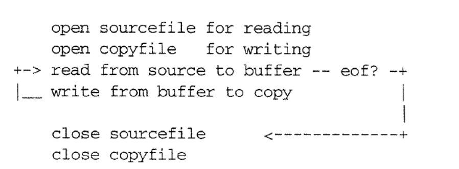
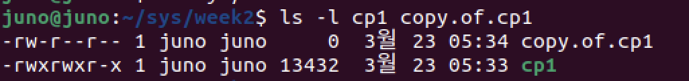
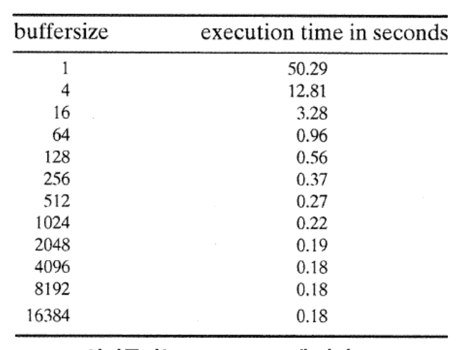

# `cp` 구현하기
### 1. What does `cp` do ?
* `cp` makes a copy of a file
``` bash
$ cp source-file target-file
```

*  if there is no targetfile , `cp` create it.
*  if there is a target file, `cp` replaces the contents of that file with the contents of the source file.

### 2. How Does `cp` Create and Write ?
* Creating / Truncating a File :
``` c
#include <fcntl.h>

int fd = creat( char *filename, mode_t mode) ;

모드의 종류 = {"O_CREAT","O_WRONLY","O_TRUNC","0644"}

fd = creat(name, 0644) ;
```

* Writing to a File :
``` c
#include <unistd.h>

ssize_t result = write(int fd, void *buf, size_t amt);
fd : a file descriptor
buf : an array
amt : how many bytes to write

n = write(fd,buffer,num);
```

### 3. implment
* logic


``` c
// cp1.c
// cp1.c

#include <stdio.h>
#include <unistd.h>
#include <fcntl.h>
#include <stdlib.h>

#define BUFFERSIZE  4096
#define COPYMODE    0644

void oops(char *, char *);

int main(int ac, char *av[]) {
    int in_fd, out_fd, n_chars;
    char buf[BUFFERSIZE];

    // Check args 
    if( ac != 3 ) {
        fprintf(stderr,"usage: %s source destination\n", *av);
        exit(1);
    }

    //Open Files
    if((in_fd = open(av[1],O_RDONLY)) == -1 ){
        oops("Cannot Open", av[1]);
    }
    if((out_fd = creat( av[2], COPYMODE)) == -1 ){
        oops("Cannot Creat", av[2]);
    }

    //Copy Files
    while( (n_chars = read(in_fd,buf,BUFFERSIZE)) > 0){
        if (write (out_fd, buf, n_chars) != n_chars){
            oops("Write error to", av[2]);
        }
    }
    if( n_chars == -1) {
        oops("Read error from ", av[1]);
    }
    
    //Close File
    if( close(in_fd) == -1 || close(out_fd) == -1 ){
        oops("Error closing files", "");
    }
}

void oops(char *s1, char *s2){
    fprintf(stderr, "ERROR : %s",s1);
    perror(s2);
    exit(1);
}
```
출력 결과
``` bash
$ gcc cp1.c -o cp1
$ ./cp1 cp1 copy.of.cp1
$ ls -l cp1 copy.of.cp1
```



### 4. More Efficient File I/O : Buffering
* Execution time for cp1
  * read(in_fd, buf, BUFFERSIZE);


-> 4096 byte 씩 읽을때부터 효율은 비슷해진다.

* System call 을 사용하면 `Mode Change`가 발생하여 시간이 소모된다.. -> 시스템 콜 사용을 최소화 하여야한다.
* Buffer에 임시 저장하는 방법을 선택한다.
  * `Kernel buffer` keeps copies of disk block in memory
  * the `read()` call copies data into a process from a kernel buffer.
  * the `write()` copies data from the process to a kernel buffer.

### 5. What to Do with System-call Errors
* System call and Errors :
  * open, read, and lseek return `-1` when an error occurs.
* How to identify what went wrong :`errno`
  * the kernel tells your program the cause of the error by storing an global variable called errno.
``` c
#define EPERM   1   // Operation not permitted
#define ENOENT  2   // No such file or directory
#define ESRCH   3   // No such process
#define EINTR   4   // Interrupted systemcall
#define EIO     5   // I/O error
```