# `ls` 구현하기
### 1. What does `ls` Do ?
``` bash
$ ls
```

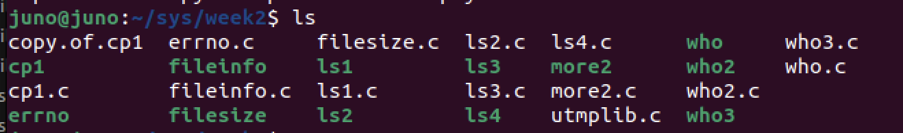

``` bash
$ ls -l
```

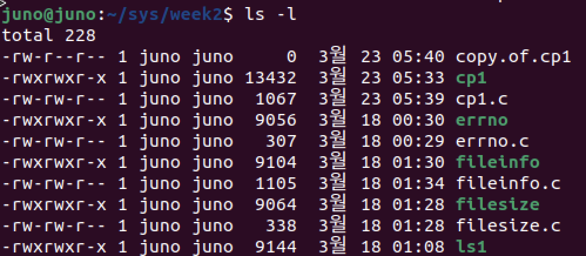

순서대로 permission, owner, group, size, modtime, name 필드이다.

* `ls` does two things 
  * Lists the contents of directories.
  * Displays information about files.
* Logic

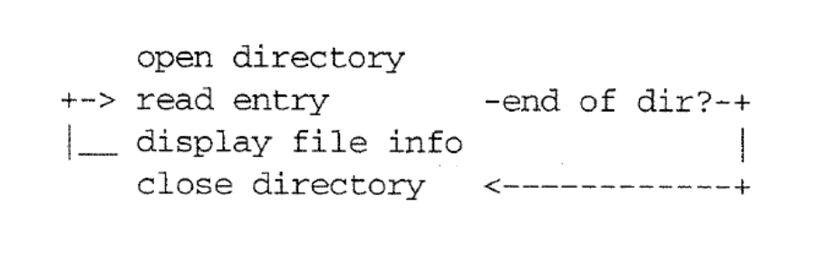

### 2. How do i read a directory ?
``` c
#include <dirent.h>
#include <sys/types.h>

DIR *opendir ( const char *dir_name );

struct dirent *readdir( DIR *dir_pointer );

// creates a connection, returns a DIR *
opendir( char * )    

// reads next record, returns a pointer to a struct dirent
readdir( DIR * )

// closes a connection
closedir( DIR * )
```

### 3. implement `ls`
``` c
// ls1.c

#include <stdio.h>
#include <sys/types.h>
#include <dirent.h>

void do_ls( char [] );

int main ( int ac, char *av[] ) {
    if ( ac == 1 ) {
        do_ls(".");
    }
    else {
        while( --ac ) {
            printf("%s: \n", *++av);
            do_ls (*av);
        }
    }
}

void do_ls( char dirname[] ) {
    DIR *dir_ptr;
    struct dirent *direntp;

    if( (dir_ptr = opendir(dirname)) == NULL ){
        fprintf(stderr, "ls1 : cannot open %s\n", dirname);
    }
    else {
        while ( (direntp = readdir(dir_ptr)) != NULL){
            printf("%s\n", direntp -> d_name);
        }
        closedir(dir_ptr);
    }
}
```
출력 결과

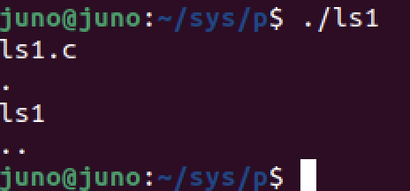

* 해결해야 할 문제들
    * Not Sorted -> Use `qsort` to sort the array
    * No Columns
    * List '.' files
    * No -l info

### 4. What Does `ls -l` Do ?

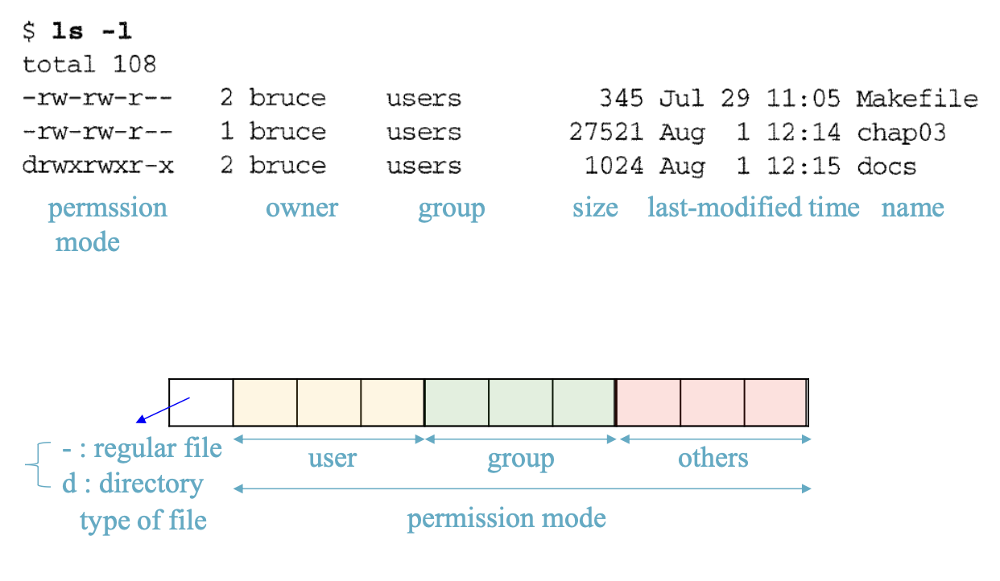

### 5. `stat` call gets file information
* How can we get information (status/properties) about a file ?
  * The system call that retrieves file status is called stat.

``` c
int stat(const char *pathname, struct stat *statbuf);

stat(name,ptr);
```

* Members of struct stat :

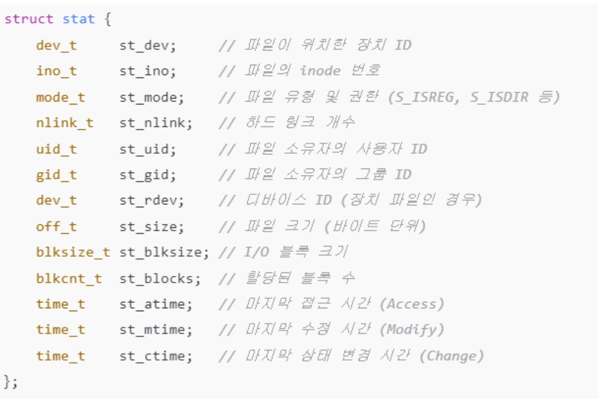

### 6. ex - fileinfo.c 
``` c
#include <stdio.h>
#include <sys/types.h>
#include <sys/stat.h>

void show_stat_info( char * , struct stat * ) ;

int main( int ac, char *av[] ) {
    struct stat info;

    if (ac > 1){
        if( stat(av[1],&info) != -1) {
            show_stat_info (av[1],&info);
            return 0;
        }
    }
    else {
        perror(av[1]);
    }

    return 1;
}

void show_stat_info(char *fname, struct stat *buf) {
    printf("   mode: %o\n", buf->st_mode);	/* type + mode */
    printf("  links: %d\n",(int)buf->st_nlink);	/* # links     */
    printf("   user: %d\n", buf->st_uid);	/* user id     */
    printf("  group: %d\n", buf->st_gid);	/* group id    */
    printf("   size: %d\n",(int)buf->st_size); 	/* file size   */
    printf("modtime: %d\n",(int)buf->st_mtime);	/* modified    */
    printf("   name: %s\n", fname );		/* filename    */
}
```
출력 결과

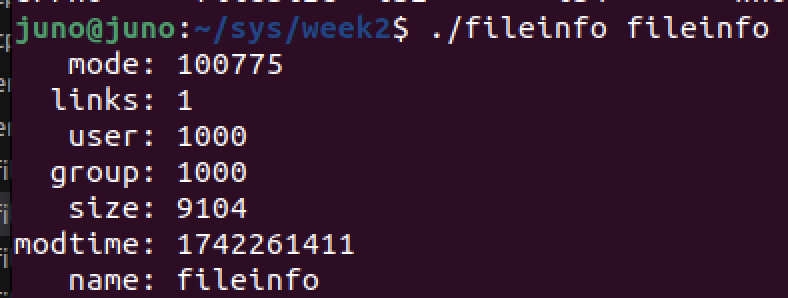

* Mod time -> Use `ctime()` to convert
* Owner, group, permssion -> Use bitwise

### 7. Converting File `Mode` to a String

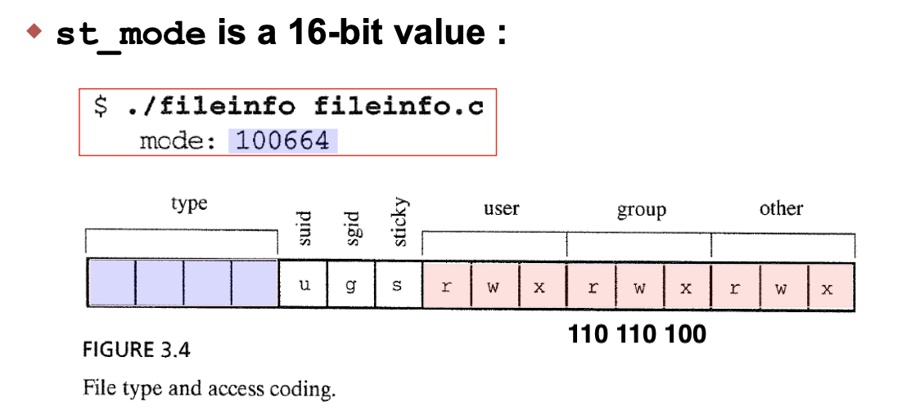

* 기본적으로, `mode`의 숫자는 16bit 8진수이다.
    * 100664 = 1 / 000 / 000 / 110 / 110 / 100
    * -rw-rw-r--

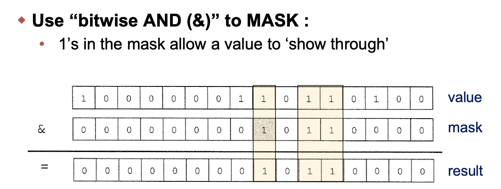

* Mask와 값을 직접 비교하여 우리가 원하는 부위만 직접 값을 추출가능하다.

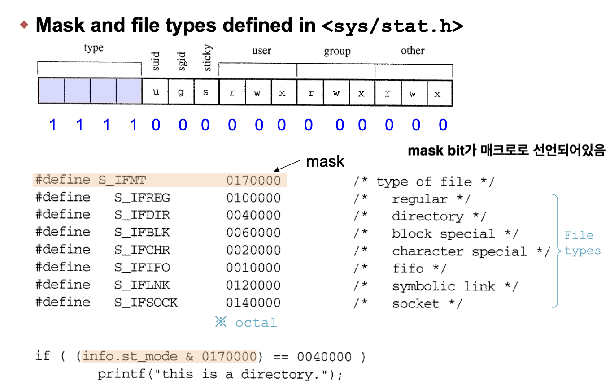

* 이제, mask를 활용하여 `mode`를 String으로 변환해보자.
``` c
#include <sys/stat.h>

void mode_to_letters( int mode, char str[])
{
	strcpy( str, "----------" );		/* dfault = no perms 	*/

	if( S_ISDIR( mode ) ) str[0] = 'd';	/* directory?		*/
	if( S_ISCHR( mode ) ) str[0] = 'c';	/* char devices		*/
	if( S_ISBLK( mode ) ) str[0] = 'b';	/* block device		*/

	if( mode & S_IRUSR )  str[1] = 'r'; 	/* 3 bits for user	*/
	if( mode & S_IWUSR )  str[2] = 'w';
	if( mode & S_IXUSR )  str[3] = 'x'; 
  
	if( mode & S_IRGRP )  str[4] = 'r'; 	/* 3 bits for group	*/
	if( mode & S_IWGRP )  str[5] = 'w';
	if( mode & S_IXGRP )  str[6] = 'x';

	if( mode & S_IROTH )  str[7] = 'r'; 	/* 3 bits for otehr	*/
	if( mode & S_IWOTH )  str[8] = 'w';
	if( mode & S_IXOTH )  str[9] = 'x';
}
```

### 8. Converting `UserID` to String
* UserID는 `/etc.passwd`에 위치한다.
* Library function `getpwuid()` 사용.
``` c
struct passwd *getpwuid(uid_t uid);

char *uid_to_name( uid_t uid ) {
    return getpwuid(uid) -> pw_name ;
}
```

### 9. Converting `Group ID` to Strings
  * `getgrgid()` Provides Access to the List of Groups
    * Defined in `/usr/include/grp.h`
``` c
struct group *getgrgid(gid_t gid);

struct group {
    char *gr_name;
    char *gr_passwd;
    gid_t gr_gid;
    char **gr_mem;
};

char *gid_to_name( gid_t gid ){
    return getgrgid(gid) -> gr_name;
}
```

### 10. Implement ls2.c
``` c
// ls2.c

#include <stdio.h>
#include <sys/types.h>
#include <dirent.h>
#include <sys/stat.h>
#include <string.h>

void do_ls(char[]);
void dostat(char *);
void show_file_info(char *, struct stat *);
void mode_to_letters(int, char[]);
char *uid_to_name(uid_t);
char *gid_to_name(gid_t);

int main(int ac, char *av[]) {
    if(ac == 1){
        do_ls(".");
    }
    else{
        while(--ac){
            printf("%s: \n",*++av);
            do_ls(*av);
        }
    }
}

void do_ls( char dirname[] ){
    DIR             *dir_ptr;
    struct dirent   *direntp;

    if ( ( dir_ptr = opendir(dirname) ) == NULL ) {
        fprintf(stderr, "ls1 : cannot open %s\n",dirname);
    }
    else {
        while( ( direntp = readdir(dir_ptr) ) != NULL ) {
            dostat( direntp -> d_name );
        }
        closedir(dir_ptr);
    }
}

void dostat( char *filename ) {
    struct stat info ;
    if ( stat(filename, &info) == -1 ){
        perror(filename);
    }
    else {
        show_file_info(filename, &info);
    }
}

void show_file_info (char *filename, struct stat *info_p) {
    char    *uid_to_name(), *ctime(), *gid_to_name(), *filemode();
    void    mode_to_letters();
    char    modestr[11];

    mode_to_letters(info_p ->st_mode, modestr) ;

    printf( "%s"	, modestr );
	printf( "%4d "	, (int) info_p->st_nlink);
	printf( "%-8s "	, uid_to_name( info_p->st_uid ));
	printf( "%-8s "	, gid_to_name( info_p->st_gid ));
	printf( "%8ld "	, (long) info_p->st_size );
	printf( "%.12s ", 4+ctime( &info_p->st_mtime )) ;
	printf( "%s\n"	, filename );
}

void mode_to_letters(int mode, char str[]) {
    strcpy( str, "----------" );		/* dfault = no perms 	*/

	if( S_ISDIR( mode ) ) str[0] = 'd';	/* directory?		*/
	if( S_ISCHR( mode ) ) str[0] = 'c';	/* char devices		*/
	if( S_ISBLK( mode ) ) str[0] = 'b';	/* block device		*/

	if( mode & S_IRUSR )  str[1] = 'r'; 	/* 3 bits for user	*/
	if( mode & S_IWUSR )  str[2] = 'w';
	if( mode & S_IXUSR )  str[3] = 'x'; 
  
	if( mode & S_IRGRP )  str[4] = 'r'; 	/* 3 bits for group	*/
	if( mode & S_IWGRP )  str[5] = 'w';
	if( mode & S_IXGRP )  str[6] = 'x';

	if( mode & S_IROTH )  str[7] = 'r'; 	/* 3 bits for otehr	*/
	if( mode & S_IWOTH )  str[8] = 'w';
	if( mode & S_IXOTH )  str[9] = 'x';
}

#include <pwd.h>

char *uid_to_name(uid_t uid) {
    struct passwd *getpwuid(), *pw_ptr ;
    static char numstr[10];

    if( ( pw_ptr = getpwuid(uid) ) == NULL ) {
        sprintf(numstr, "%d", uid);
        return numstr;
    }
    else {
        return pw_ptr->pw_name;
    }
}

#include <grp.h>

char *gid_to_name(gid_t gid) {
    struct group *getgrgid(), *grp_ptr;
    static char numstr[10];

    if( ( grp_ptr = getgrgid(gid) ) == NULL ) {
        spirntf(numstr,"%d",gid);
        return numstr;
    }
    else {
        return grp_ptr->gr_name;
    }

}
```
출력 결과

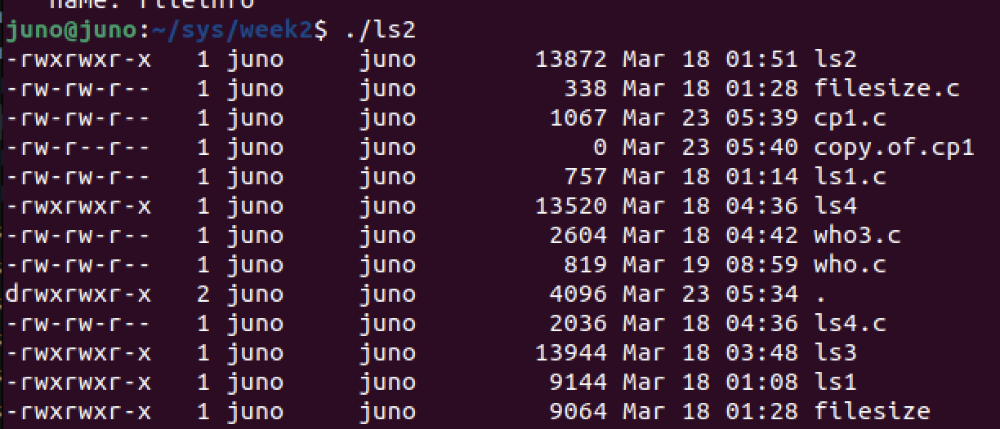