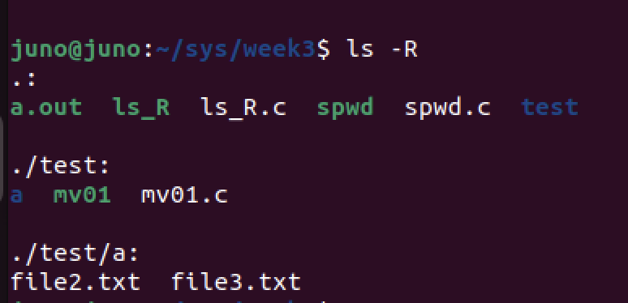

# `ls -R`명령어 구현하기.
### 1. `ls -R`이 하는 일



* `ls -R`은 현 디렉토리에서부터 하위 디렉토리 까지의 모든 파일들을 위 양식대로 출력하는 메서드 이다.
* 하위 디렉토리의 접근은 재귀적으로 실행된다.

### 2. Logic 
1. 현 디렉토리를 `Open`하고, `Read`한다.
2. `Read`한 것이 파일이라면 출력을 하고, 디렉토리라면 다시 함수를 호출한다. (재귀적)
3. 하위 폴더가 없다면 재귀를 종료한다. 이때, 모든 디렉토리에는 `.`, `..`이 있으므로 , 두 디렉토리는 무시한다.

### 3. implement `ls -R`
``` c
#include <stdio.h>
#include <sys/types.h>
#include <sys/stat.h>
#include <dirent.h>
#include <stdlib.h>
#include <string.h>
#include <limits.h>
// #include <linux/limits.h>

void do_ls(char[]);


int main (int ac, char *av[])
{
    if( ac == 1){
		do_ls(".");
    }
    else
		while( --ac ){
			do_ls( *++av );
		}
}

void do_ls(char dirname[]) {
    char path[PATH_MAX];
    DIR *dir_ptr;
    struct dirent *direntp;
    struct stat info;

    // 디렉토리 경로 출력
    printf("\n%s:\n", dirname);

    // 디렉토리 열고
    if ((dir_ptr = opendir(dirname)) == NULL) {
        fprintf(stderr, "cannot open %s\n", dirname);
        return;
    }

    // 파일 및 디렉토리 이름 출력
    while ((direntp = readdir(dir_ptr)) != NULL) {
        // 숨김 파일 무시
        if (direntp->d_name[0] == '.')
            continue;

        // 전체 경로 생성
        snprintf(path, sizeof(path), "%s/%s", dirname, direntp->d_name);

        // 정보 얻기
        if (stat(path, &info) == -1) {
            perror("stat error");
            continue;
        }

        // 그냥 이름만 출력
        printf("%s\n", direntp->d_name);
    }

    closedir(dir_ptr);

    // 디렉토리들만 재귀 탐색
    if ((dir_ptr = opendir(dirname)) == NULL)
        return;

    while ((direntp = readdir(dir_ptr)) != NULL) {
        if (direntp->d_name[0] == '.')
            continue;

        snprintf(path, sizeof(path), "%s/%s", dirname, direntp->d_name);
        if (stat(path, &info) == -1)
            continue;

        if (S_ISDIR(info.st_mode)) {
            do_ls(path);  // 재귀 호출
        }
    }

    closedir(dir_ptr);
}

```

자, 그럼 코드를 뜯어서 분석해보도록 하자.

##### 1. main()
``` c
int main (int ac, char *av[])
{
    if( ac == 1){
        do_ls(".");
    }
    else
        while( --ac ){
            do_ls( *++av );
        }
}
```
* 사실 실제 `ls -R`의 경우 `ls`메서드에 `-R`옵션을 추가하는 것 이기에 `main()`메서드를 수정해야했으나.. 스킵했다.

##### 2. do_ls() 선언 및 변수
``` c
void do_ls(char dirname[]) {
    char path[PATH_MAX];
    DIR *dir_ptr;
    struct dirent *direntp;
    struct stat info;
```
* `dirname[]` : 탐색할 디렉토리 이름
* path[PATH_MAX] : dirname과 내부 파일명을 합쳐 전체 경로를 저장하는 버퍼이다. 자세한 내용은 같은 repo에 `mv.c 구현하기`글을 확인해보라 !

##### 3. do_ls() 이름 출력 , 디렉토리 열기, 첫번째 loop 
```c
    // 현재 처리중인 디렉토리의 이름을 출력한다.
    printf("\n%s:\n", dirname);

    if ((dir_ptr = opendir(dirname)) == NULL) {
        fprintf(stderr, "cannot open %s\n", dirname);
        return;
    }

    while ((direntp = readdir(dir_ptr)) != NULL) {
        if (direntp->d_name[0] == '.')
            continue;

        snprintf(path, sizeof(path), "%s/%s", dirname, direntp->d_name);

        if (stat(path, &info) == -1) {
            perror("stat error");
            continue;
        }

        printf("%s\n", direntp->d_name);
    }

    closedir(dir_ptr);
```
loop를 자세히 살펴보자.
* 디렉토리 내의 항목을 순회하는데, `'.'`으로 시작하는 항목 (숨김파일)은 출력하지 않는다. 
* `path`에 `dirname`을 덧붙여 전체 경로를 만들고 `stat()`으로 정보를 가져온다.

##### 4. do_ls() 두번째 loop - 재귀탐색
``` c
    if ((dir_ptr = opendir(dirname)) == NULL)
        return;

    while ((direntp = readdir(dir_ptr)) != NULL) {
        if (direntp->d_name[0] == '.')
            continue;

        snprintf(path, sizeof(path), "%s/%s", dirname, direntp->d_name);
        if (stat(path, &info) == -1)
            continue;

        if (S_ISDIR(info.st_mode)) {
            do_ls(path);  // 재귀 호출
        }
    }

    closedir(dir_ptr);
}
```
* 숨김 디렉토리는 무시한다. 
* `stat()`으로 얻은 정보중에 , `S_ISDIR`을 사용해 디렉토리인지 확인한다.
  * 만약 디렉토리라면, 재귀적 호출을 한다. (하위 디렉토리 탐색)
  * 재귀 탐색의 종료조건은 마지막 디렉토리까지 가서 더이상 디렉토리가 없을때 이다.
  * 그러나 마지막 디렉토리에도 `'.'`,`'..'` 디렉토리는 존재하기 때문에 해당 숨김파일을 무시하지 않으면 무한히 순회하므로 조심하자.

##### 5. 나의 뻘짓
* Systemprogrammig 과제라서 급하게 좀 풀어보고 있었는데 수많은 뻘짓을 했다. 
* 첫번째로는 `.`,`..` 디렉토리를 무시하지않아서 대참사가 났다는 것이다.
* 두번째 문제는 하위 디렉토리는 정상적으로 출력이 되는데 현 디렉토리는 파일이 제대로 출력이 안되는 문제가 있었다.
  * 이 문제는 재귀함수의 구조적인 문제였는데, 문제는 대충 이러하였다.
    * 현 dir read중 dir를 만남 -> 하위 dir을 read.. -> .. -> ... 이렇게 되다가 현 dir read가 종료된다는 문제였는데, 사실 아직 이해는 안간다. 함수 스택이 쌓여서 기록이 남지않나 ..?
  * 그래서 아무튼 재귀 전에 파일을 한번 더 열어서 print하기로 하였다... 똥코드다 진짜 . 
  * 다음은 지피티 형님의 대답이다..
    ✅ 답변:
    아니, 현재 디렉토리의 read point는 보존되지 않아.
    하지만 너의 코드에서는 문제가 되지 않아. 왜냐하면 readdir() 루프와 재귀 호출이 분리되어 있기 때문이야.

    🔍 더 자세히 설명해볼게
    💡 DIR*는 디렉토리의 핸들이고, 내부적으로 **파일 디스크립터 + 오프셋(read point)**를 관리해.
    readdir()는 호출될 때마다 디렉토리 스트림에서 다음 항목을 읽어옴.

    만약 한 디렉토리를 열고 있다가 그 도중에 같은 디렉토리를 다시 열어서 readdir()을 또 시작하면, → 새로운 스트림이기 때문에 기존 스트림의 위치(read offset)와는 별개야.
이번주 과제는 좀 빡셌다. `mv.c`구현은 깔끔하게 했는데 이 코드가 좀 힘들었네. 고생하셨습니다. 