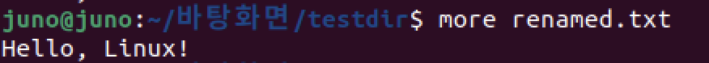
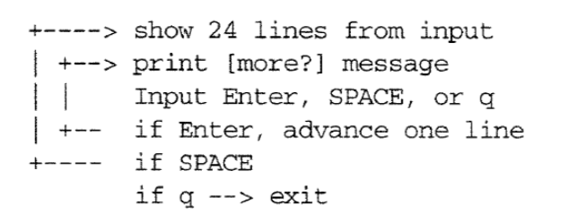
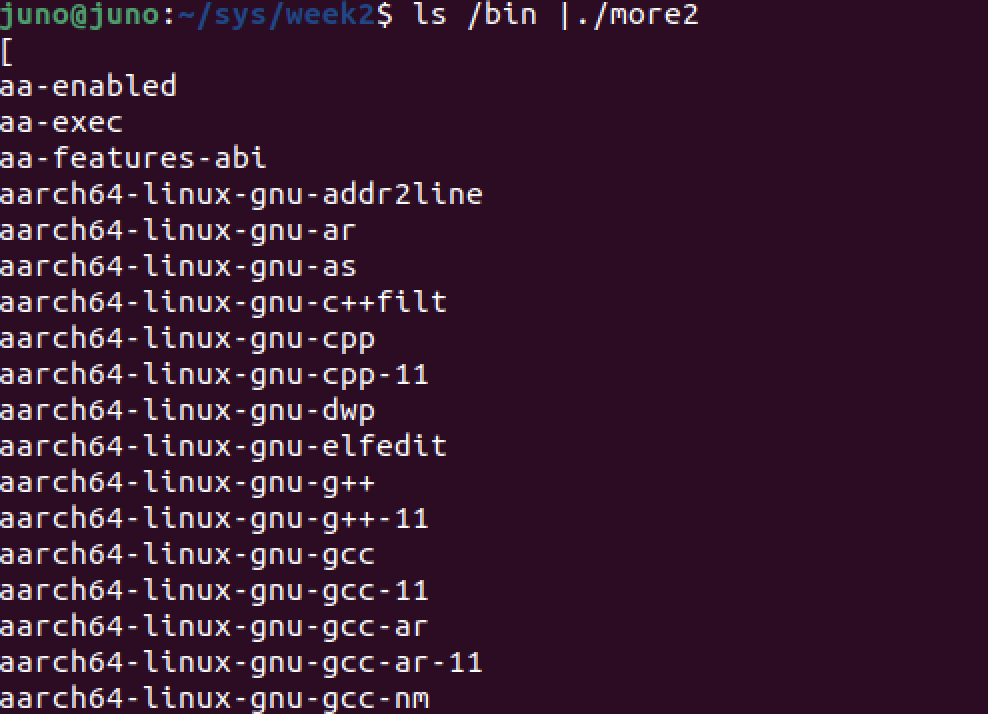

# `more.c` 구현하기
### 1. what does mre do ?
* it displays a file one screenful at a time


* logic



### 2. implement
``` c
#include <stdio.h>
#include <stdlib.h>

#define PAGELEN 24 // 한번에 출력되는 단위
#define LINELEN 512 // 한줄 읽는 단위

void do_more(FILE * );
int see_more();

int main(int ac , char *av[]){
    FILE *fp ;
    if(ac == 1 ) // 인자가 하나일때 정상 실행
        do_more(stdin);
    else
        while(--ac)
            if( (fp = fopen(*++av, "r")) != NULL) {
                do_more(fp);
                fclose(fp);
            }
            else   
                exit(1);
    return 0;
}

void do_more(FILE *fp) {
    char line[LINELEN];
    int num_of_lines = 0 ;
    int see_more() , reply ;

    while (fgets(line, LINELEN, fp)) { //파일 한줄씩 읽기
        if(num_of_lines == PAGELEN) {
            reply = see_more();
            if( reply == 0 ) 
                break;
            num_of_lines -= reply;
        }
        if ( fputs(line,stdout) == EOF ) // 파일 출력
            exit(1);
        num_of_lines ++ ; //Count lines
    }
}

int see_more() {
    int c; 
    printf("\033 [more? \033[m");
    while ( (c = getchar()) != EOF ){ // 입력 받기
        if ( c == 'q')
            return 0;
        if ( c == ' ') //공백 입력시 24줄 출력
            return PAGELEN ;
        if ( c == '\n') //엔터 입력시 한줄
            return 1;
    }
    return 0;
}
```

* `main` 
``` c
int main(int ac , char *av[]){
    FILE *fp ;
    if(ac == 1 ) // 인자가 하나일때 정상 실행
        do_more(stdin);
    else
        while(--ac)
            if( (fp = fopen(*++av, "r")) != NULL) {
                do_more(fp);
                fclose(fp);
            }
            else   
                exit(1);
    return 0;
}
```
우리는 터미널 상에서 다음과 같이 메서드를 입력할것이다.
``` bash
$ ./more filename
``` 
이때 `ac = 2` , `av[] = { "./more", "more.c" }`가 된다.
그러므로 while문을 들어가 `*++av == av[1] == more.c`이므로 해당 파일을 실행해 함수를 수행하고 닫게 된다.

* `void do_more(FILE *)`
``` c
void do_more(FILE *fp) {
    char line[LINELEN];
    int num_of_lines = 0 ;
    int see_more() , reply ;

    while (fgets(line, LINELEN, fp)) { //파일 한줄씩 읽기
        if(num_of_lines == PAGELEN) {
            reply = see_more();
            if( reply == 0 ) 
                break;
            num_of_lines -= reply;
        }
        if ( fputs(line,stdout) == EOF ) // 파일 출력
            exit(1);
        num_of_lines ++ ; //Count lines
    }
}
```
파일 포인터 `fp`를 `fgets`를 통해 `LINELEN`단위로 저장하게 된다.
그후 `fput`으로 출력을 하고 `num_of_lines ++`를 실행하게 되고,
`num_of_lines == PAGELEN`을 만족할 때 `see_more()`을 실행한다.

*`see_more()`
``` c
int see_more() {
    int c; 
    printf("\033 more? \033");
    while ( (c = getchar()) != EOF ){ // 입력 받기
        if ( c == 'q')
            return 0;
        if ( c == ' ') //공백 입력시 24줄 출력
            return PAGELEN ;
        if ( c == '\n') //엔터 입력시 한줄
            return 1;
    }
    return 0;
}
```
`more?`을 출력하고 `getchar()`을 통해 사용자의 입력을 받는다.
`q`일시 종료, `공백`입력시 24줄을 출력, `엔터`입력시 한 줄을 출력한다.

### 3. Using Pipeline
```c
#include <stdio.h>
#include <stdlib.h>

#define PAGELEN 24 // 한번에 출력되는 단위
#define LINELEN 512 // 한줄 읽는 단위

void do_more(FILE * );
int see_more(FILE * ); // changed

int main(int ac , char *av[]){
    FILE *fp ;
    if(ac == 1 ) // 인자가 하나일때 정상 실행
        do_more(stdin);
    else
        while(--ac)
            if( (fp = fopen(*++av, "r")) != NULL) {
                do_more(fp);
                fclose(fp);
            }
            else   
                exit(1);
    return 0;
}

void do_more(FILE *fp) {
    char line[LINELEN];
    int num_of_lines = 0 ;
    int see_more() , reply ;
    FILE *fp_tty ; //new

    //new
    fp_tty = fopen("/dev/tty", "r");
    if (fp_tty == NULL) 
        exit(1

    while (fgets(line, LINELEN, fp)) { //파일 한줄씩 읽기
        if(num_of_lines == PAGELEN) {
            reply = see_more(fp_tty); //changed
            if( reply == 0 ) 
                break;
            num_of_lines -= reply;
        }
        if ( fputs(line,stdout) == EOF ) // 파일 출력
            exit(1);
        num_of_lines ++ ; //Count lines
    }
}

int see_more(FILE *cmd) {
    int c; 
    printf("\033 [more? \033[m");
    while ( (c = getc(cmd)) != EOF ){ // changed
        if ( c == 'q')
            return 0;
        if ( c == ' ') //공백 입력시 24줄 출력
            return PAGELEN ;
        if ( c == '\n') //엔터 입력시 한줄
            return 1;
    }
    return 0;
}
```


### 4. 파이프라인을 사용하는 이유
1. 프로세스 간 데이터를 전달 할 수 있다.
``` bash
$ ls -l | more # ls -l 의 출력을 more이 받아서 실행
```
2. 성능 향상 (병렬 처리 가능)
3. 메모리 절약 (파일 저장 없이 데이터 처리 가능)
    - 임시 파일 없이 직접 데이터를 넘겨주기 때문에 디스크 I/O 부담이 줄어든다.
4. 유연성과 재사용성