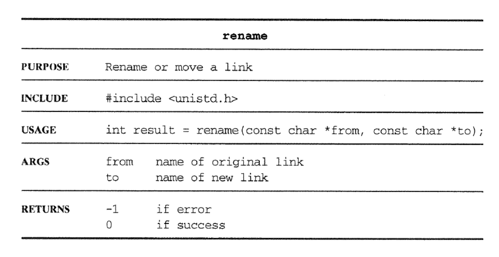
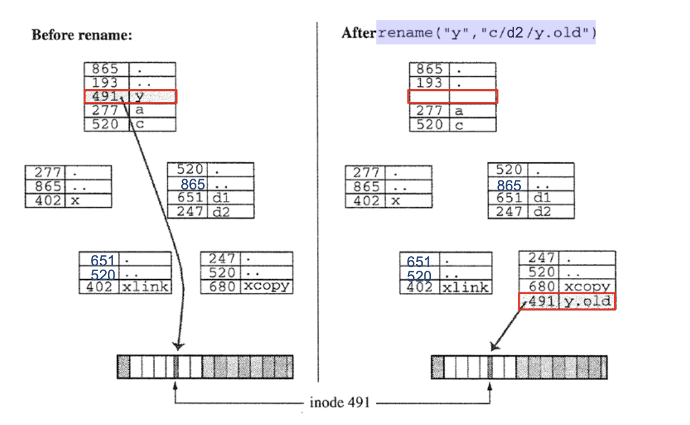
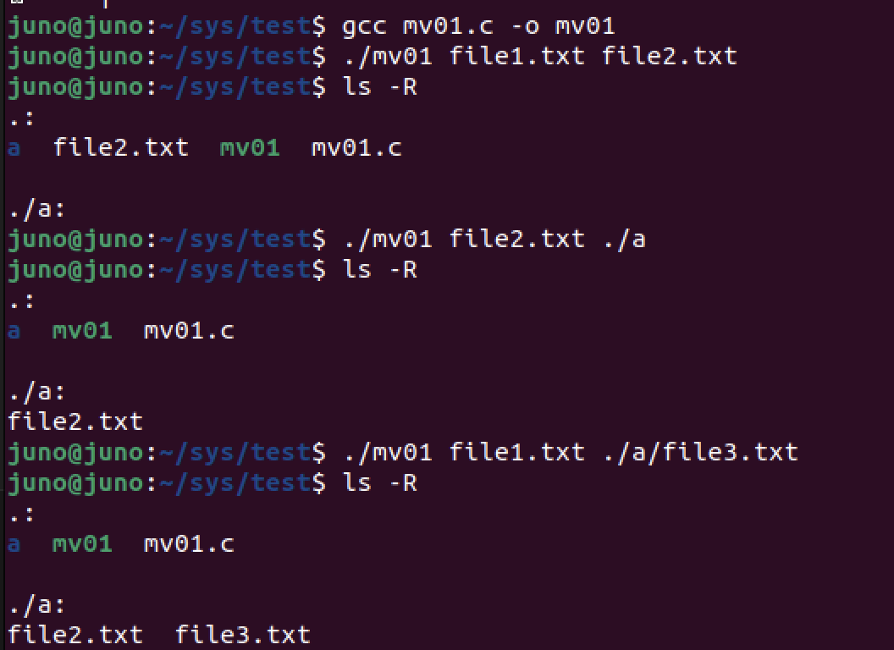

# `mv` 구현하기
### 1. What does `mv` do ?
`mv` : Changes the name or location of a file or directory
* Uses `rename()` system call



* logic
  1. `mv fromA toB` 가 입력되면 `toB`가 file인지 directory인지 확인한다.
   
  2-1. if `toB` == file : `fromA`의 파일 이름을 `toB`로 바꾼다.

  2-2. if `toB` == directory : `fromA`를 `toB` 의 하위파일로 옮긴다.

### 2. How `rename` works 



``` bash 
$ rename("y", "c/d2/y.old") 
```
-> `y`를 `c/d2` 하위 파일로 `y.old`로 만든다.
* Basic logic : 
    Copy original link to new name and / or location delete original link.

### 3. implement

``` c
/*
mv01.c
1. 명령어를 인자로 받음... ac = 3 , av = ["./mv01", "from" , "to"]
2. av[2] is file ? 
2-1. true -> rename()
2-2. flase .. 디렉토리로 이동.
*/

#include <stdio.h>
#include <sys/types.h>
#include <sys/stat.h>
#include <dirent.h>
#include <stdlib.h>
#include <string.h>
#include <unistd.h>
#include <limits.h>


int is_dir(const char *path);
void addstring(char *real_path, size_t size, const char *dir,const char *filename);

int main(int ac, char* av[]) {
    char path[PATH_MAX];

    if( ac != 3 ) {
        fprintf(stderr,"명령어 똑바로 치세여 ~\n");
        exit(1);
    }

    char *src = av[1];
    char *dst = av[2];

    // dst가 dir이라면 !
    // rename 쓸때.. 뒷쪽인자에 "dst/src" 로 하면 파일 이동 가능
    // 그럼 .... 문자열 합성을 해야함
    if(is_dir(dst)){
        // 문자열 합성
        addstring(path, sizeof(path),dst,src);
        if(rename(src,path) == -1 ){
            fprintf(stderr,"파일 이동 실패\n");
            exit(1);
        }
    }

    // dst가 file이라면 !
    else {
        if(rename(src,dst) == -1 ){
            fprintf(stderr,"파일 리네임 실패..\n");
            exit(1);
        }
    }
    


}

int is_dir(const char *path){
    struct stat info;
    if(stat(path, &info) == -1 ) return 0;
    return S_ISDIR(info.st_mode);
}

void addstring(char *real_path, size_t size, const char *dir,const char *filename){
    snprintf(real_path, size, "%s/%s",dir,filename);
}
```

* 출력결과



``` bash
$ ./mv01 file1.txt file2.txt
```
의 결과로 현 디렉토리에 `file2.txt`로 `rename`된걸 볼 수 있다.

``` bash
$ ./mv01 file2.txt ./a
```
`file2.txt` 를 `./a` 디렉토리로 옮겼음을 알 수 있다.

그 후, 나는 `file1.txt`를 새로 만들었다.
``` bash
$ ./mv01 file1.txt ./a/file3.txt
```
`file1.txt`가 `./a`디렉토리의 `file3.txt`로 저장됨을 알 수 있다.