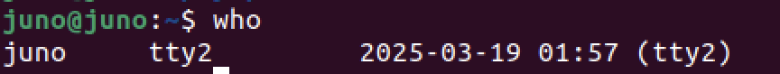
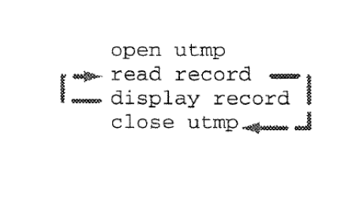
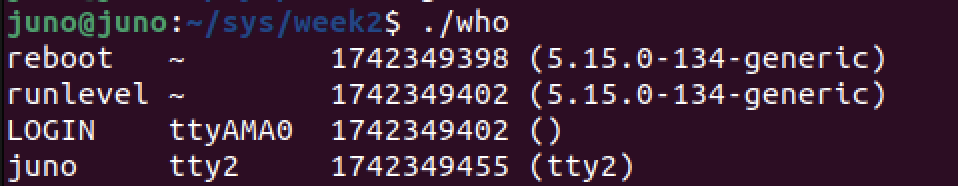

# `who` 구현하기
### 1. How does `who` Do it 
`who` : Identifies users currently logged in
``` bash 
$ who
```


* what is TTY (Tele Type writer) ?
    * 표준 입력에 연결된 터미널의 파일 이름을 의미한다.
    * 리눅스는 디바이스 드라이버를 통해 OS에 접속할 수 있도록 하는데, 여기서 접속 매개체인 콘솔 또는 터미널을 통해 물리적으로 OS의 CLI에 접속할 수 있게 해주는 가상의 디바이스 드라이버이다.
    * TTY0부터 TTY6까지 총 7개가 존재하며, 사용자는 총 7개 까지 콘솔 또는 터미널에 동시접근이 가능하다.

* logic


    * Two tasks we need to program
      * Read structs from a file
      * Display the information stored in a struct

### 2. `open`, `read`, `close` 
* `read` : read from a file descriptor
    ``` c
    ssize_t read(int fd, void *buf, size_t count);
    // fd에 위치한 파일을 count단위로 읽어서 buf에 저장
    ```
* `open` : Opening a file
    ``` c
    fd = open(char *name, mode) ;
    // name이란 파일을 mode로 읽는다
    mode = { O_RDONLY , O_WRONLY , O_RDWR } ;
    //모드의 종류
    // 각각 읽기 전용, 쓰기전용, 읽고쓰기 모드이다.
    ```
### 2. implement
``` c
// who.c 구현
#include <stdio.h>
#include <utmp.h>
#include <fcntl.h>
#include <unistd.h>
#include <stdlib.h>
#include <utmpx.h>

#define SHOWHOST

void show_info (struct utmp*);

int main () {
    struct utmp current_record ;
    int utmpfd ;
    int reclen = sizeof(current_record);

    //우리가 원하는 data들은 UTMP_FILE 에 있음.
    if( ( utmpfd = open(UTMP_FILE, O_RDONLY )) == -1 ) {
        perror(UTMP_FILE); // UTMP_FILE is in utmp.h
        exit(1);
    }
    while ( read(utmpfd, &current_record, reclen) == reclen){
        show_info(&current_record);
    }
    close(utmpfd);
    return 0;
}

void show_info( struct utmp *utbufp )
{
	printf("%-8.8s", utbufp->ut_name);  //logname
	printf(" ");					
	printf("%-8.8s", utbufp->ut_line);  // tty
	printf(" ");						
	printf("%10ld", utbufp->ut_time);   // login time
	printf(" ");						
#ifdef SHOWHOST
	printf("(%s) ", utbufp->ut_host);   // host
#endif
	printf("\n");	
}
```
출력결과


* 개선 할 것   
    * Suppress blank records
    * Get the Log-in times correct using ctime

### 3. implement - 2
* Suppress blank records 
    * /usr/include/utmp.h 에는 `USER_PROCESS`가 정의 되어있다.
    * `USER_PROCESS` represents the user logged into the system.
-> Modification
```c
show_info(struct utmp *utbufp) {
    if( utbufp -> ut_type != USER_PROCESS ) // USER만 표시할 수 있겠다 ..!
        return ;
    printf("%-8.8s", utbufp -> ut_name);
}
```

* 사람에게 친화적이게 시간을 표시해보자 !
    * How Unix stores times : `time_t`
    * Making a `time_t` readable : `ctime`
``` c
#include <time.h>

char *ctime(const time_t *timep);
```
``` bash
>> "Wed Jun 30 21:49:08 1993\n"
```

``` c 
/* who2.c - read /var/adm/utmp and list info therein
*			     - suppresses empty records
*               - formats time nicely
*/
#include <stdio.h>
#include <unistd.h>
#include <utmp.h>
#include <fcntl.h>
#include <time.h>
#include <stdlib.h>

#define SHOWHOST			/* include remote machine on output */
void showtime(long);
void show_info( struct utmp *utbufp );

int main()
{
	struct utmp utbuf;						/* read info into here */
	int	utmpfd;								/* read from this descriptor */

	if( ( utmpfd = open(UTMP_FILE, O_RDONLY)) == -1 ) {
		perror( UTMP_FILE );				/* UTMP_FILE is in utmp.h */
		exit(1);
	}

	while( read(utmpfd, &utbuf, sizeof(utbuf) ) == sizeof(utbuf) )
		show_info(&utbuf);
	close(utmpfd);

	return 0;
}

/*
* show info()
*		display the contents of the utmp struct in human readale form
*		*displays nothing if record has no user name
*/
void show_info( struct utmp *utbufp )
{
	if( utbufp->ut_type != USER_PROCESS)		/* users only ! */
		return;

	printf("%-8.8s", utbufp->ut_name);	/* the logname */
	printf(" ");											/* a space		*/
	printf("%-8.8s", utbufp->ut_line);		/* the tty */
	printf(" ");											/* a space		*/
	showtime( utbufp->ut_time);
#ifdef SHOWHOST
	if( utbufp->ut_host[0] != '\0' )
		printf(" (%s) ", utbufp->ut_host);		/* the host */
#endif
	printf("\n");	
}

void showtime( long timeval )
/*
 * displays time in a format fit for human consumption
 * uses ctime to build a string then pics parts out of it
 * Note: %12.12s prints a string 12 chars wide and LIMITS it to 12 chars.
 */
{
	char *cp;								/* to hold address of time */
	cp = ctime(&timeval);			/* convert timeto stirng */
												/* string looks like Mon Feb 4 00:46:40 EST 1991 */
	printf("%12.12s", cp+4);	/* pick 12 chars from pos 4 */
}
```
출력결과


